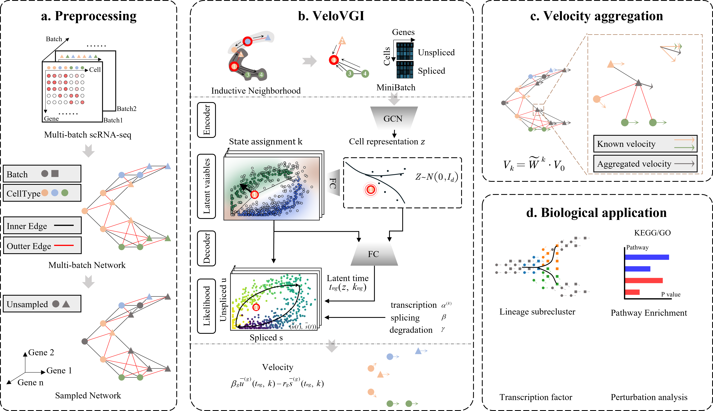

# VeloVGI WorkStation

## 流程图

## 文件说明

1. velovgi: 模型文件
2. docs: 操作文档
3. data：数据
4. notebook: 示例notebook
    - local_pc: 本地个人计算机的notebook（WSL，Ubuntu环境）
    - lab_server：实验室服务器的notebook（Ubuntu环境）
    - cluster_server：集群服务器的notebook

## 开发过程记录

## 23_04_24_1 结构初始化，项目的模型velovgi代码结构调整

1. 参考模型结构
    - ScVelo: https://github.com/theislab/scvelo/tree/master/scvelo
    - Scanpy: https://github.com/scverse/scanpy/tree/master/scanpy
    - CellRank: https://github.com/theislab/cellrank
    - Dynamo: https://github.com/aristoteleo/dynamo-release/tree/master/dynamo
    - LatentVelo: https://github.com/Spencerfar/LatentVelo/tree/main/latentvelo
    - scvi-tool: https://github.com/scverse/scvi-tools/tree/main/scvi
2. 思考：
    - ScVelo的结构最清晰合理，主要参考这里的结构
    - scvi-tool都是用深度学习的，参考其中模型结构
    - LatentVelo基于深度学习，与本项目应该最类似

3. 本项目模型设计：
    - preprocessing(pp): 预处理部分
    - tools(tl): 这里存放之前写好的velovgi模型代码
    - plotting(pl): 绘图部分
    - utils：比较杂的工具部分
    - \__init__: 管理整体包

4. 把之前的项目的模型velovgi代码结构调整，使用了`notebook/local_pc/23_04_24_02_项目结构导入_调整文件结构.ipynb`进行测试

## 开发日志

[开发日志链接][dev_log_index]

[dev_log_index]: ./docs/dev_log/index.md

## 主分支合并记录

1. main init:
